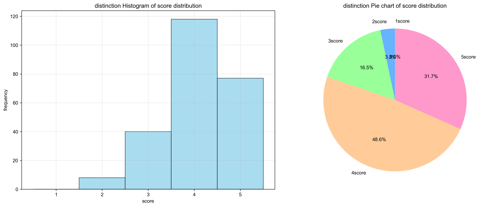
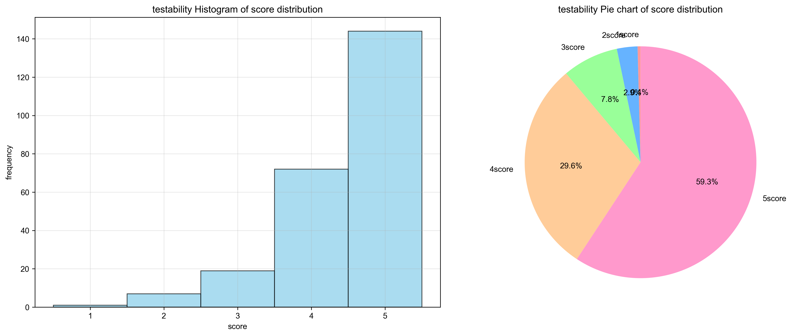
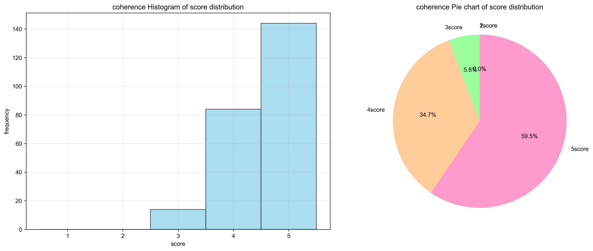

# Questionnare

## Overall rating

### Real scene alignment (1-5)

To what extent do you think the above conversation scenario reflects the real development process (whether it is your thinking process in development practice or the communication process with AI)?

## Score for this round

### 1. Instruction Distinction (1-5)

Does the new instruction in each round add/modify functions based on the previous round? Is there a differentiating factor between the instructions in subsequent rounds and those in previous rounds, making it difficult to be directly implemented by the previous round?

### 2. Instruction Testability (1-5)

Can each new instruction in each round be tested with test cases to ensure that there are no instructions that are difficult to test in terms of readability, efficiency, etc.?

### 3. Instruction Coherence (1-5)

Does each new round of instructions have no redundant steps? Does the logical implementation relationship of the instructions progress?

### 4. Test case quality (Yes | Partially | No)

The test cases correctly cover the requirements of this round, rather than the general requirements or the requirements of the previous round.

### 5. Code Quality (Yes | Partially | No)

Whether the code correctly implements the requirements of this round based on the previous round.

# User study results

## Distinction

## Testability

## Coherence

